<div align="center">
  <h1>Biblioteca de juegos</h1>
</div>

Projecto donde simulo una biblioteca de juegos.

<div align="center">
  
</div>

> Ya le dare tiempo al diseño

<h2 align="center">Tecnologias usadas</h2>

- javascript (con express)
- ejs
- mysql

<h2 align="center">Como usarlo</h2>

> Actualmente estoy en [Manjaro Linux](https://manjaro.org/) (distro basada en [Arch-Linux](https://archlinux.org/)), asi que quizas en futuras versiones cambio el modo de instalacion

<h2> Comenzemos </h2>

> Primero actualize su sistema Linux
>
> ```bash
> sudo pacman -Syuu
> ```

Instalar mysql

```bash
sudo pacman -S mysql
```

> si le da a escoger entre dos opciones: pulse la tecla enter

Instalar mysql-workbench (opcional)
Esto instalara una interfaz grafica

```bash
sudo pacman -S  mysql-workbench
```

Comando para configurar mysql

```bash
mariadb-install-db --user=mysql --basedir=/usr --datadir=/var/lib/mysql
```

Verificar el estado de mysql.

> Estoy usando systemd. Desconosco la forma de verificar si un programa esta en ejecucion

```bash
systemctl status mysql
```

Esta es la salida:

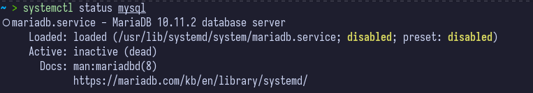

Inciar el servicio de mysql

```bash
systemctl start mysql
```

> Se require la contraseña de su usuario

Esta es la salisa:

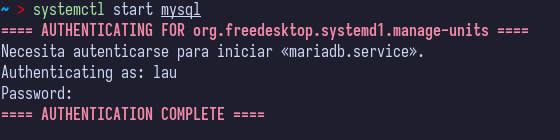

// Ver de nuevo el estado de mysql

```bash
systemctl status mysql
```

Esta es la salida:

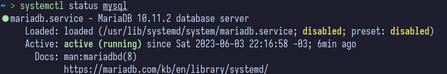

// El servicio ya esta en ejecucion

Habilitar el servicio para que inicio cuando prenda el equipo (opcional)

```bash
systemctl enable mysql
```
Esta es la salida:

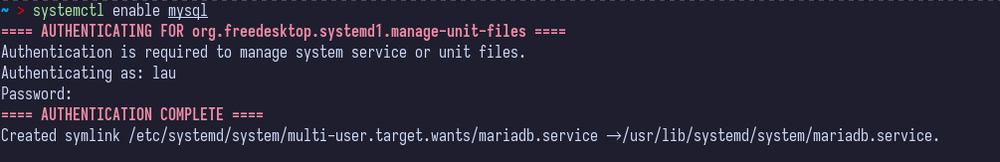

// El servicio se inicia cuando se prenda el equipo

<h2> Configurar mysql </h2>

```bash
sudo mysql_secure_installation
```

> Esto dara una serie de preguntas para la configuracion se seguridad de la base de datos

Iniciar en la interfaz de comando de mysql

```bash
sudo mysql
```

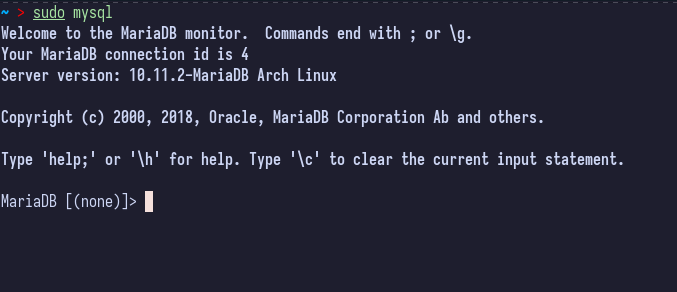

Crear usuario

```bash
create user ‘username’@’localhost’ identified by ‘password’;
```

Ejemplo:

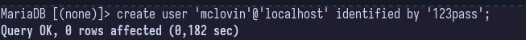

Dar privilegios al usuario recien creado:

```bash
grant all privileges on *.* to 'username'@'localhost' with grant option;
```

Ejemplo:

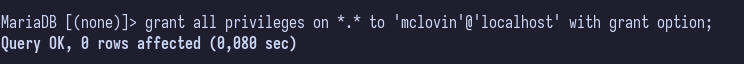

Vaciar cache:

```bash
flush privileges;
```

Salir

```bash
exit
```

<h2> Acceder a mysql con nuestro usuario </h2>

> Primero lo hago desde la terminal

Acceder a mysql

```bash
mysql -u mclovin -p
```

Crear base de datos

```bash
create database nombre_de_la_base_de_datos;
```

Ejemplo:

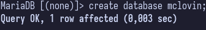

Ver las bases de datos

```bash
show databases;
```

Ejemplo y salida:

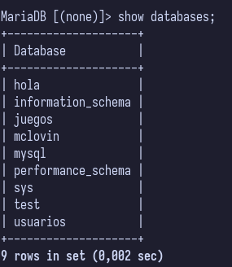

<h2> Usando mysql-workbench </h2>

Iniciar mysql

> Se inicia buscando mysql-workbench. Como es un interfaz grafica debe estar en el menu de aplicaciones.

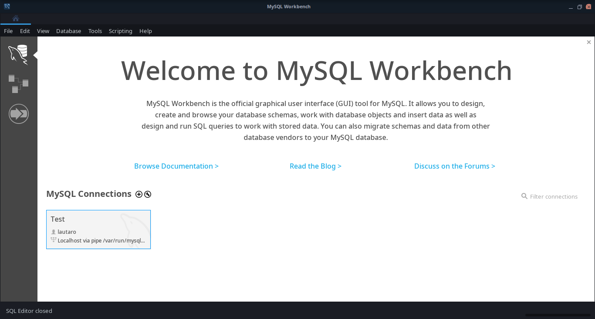

> Se tiene que dar click en el circulo con un simbolo de mas (+)


Crear nueva configuracion

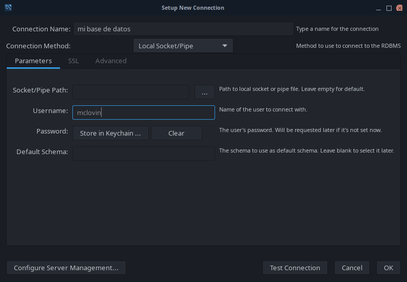

Le pulsan en "ok".
Es posible que cuando creen la conexion le salga una advertencia que diga "mysql-workbench no es compatible con la vercion de mariaDB" no me dio ningun problema, asi que no debe haber problemas.

Cuando vea las conexiones van a ver 1 (o 2 en mi caso)

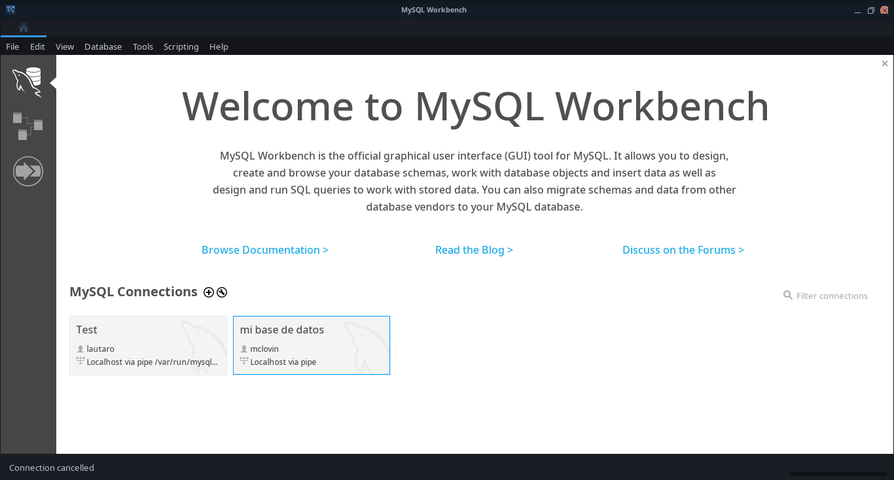

De doble click a la conexion resien creada. Se le pedira autenticarce con la contraseña del usuario creado

Es posible que cuando creen la conexion le salga una advertencia que diga "mysql-workbench no es compatible con la vercion de mariaDB" no me dio ningun problema, asi que no debe haber problemas.

Los comando para crear tabla (create database nombre_de_la_base_de_datos) y ver bases de datos (show databases) funcionan aqui de igual manera

// FIN

