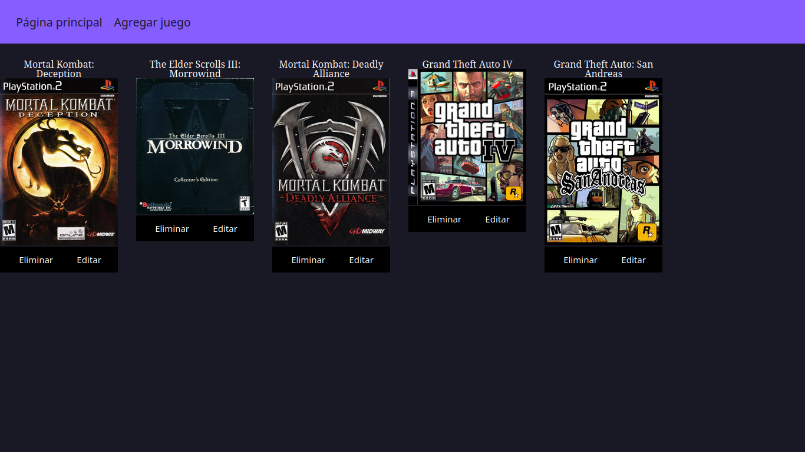

  <h1>Biblioteca de juegos</h1>

Projecto donde simulo una biblioteca de juegos.

  

  <h2> Pag para agregar juegos en la biblioteca <h2>
  

  <h2> Pag para editar la informacion de un juego existentia <h2>
  

<h2 align="center">Tecnologias usadas</h2>

- Javascript - Con Express JS
- EJS - Motor de plantillas
- MySQL - Base de datos

[Instalar mysql](instalarMySQL.md)

